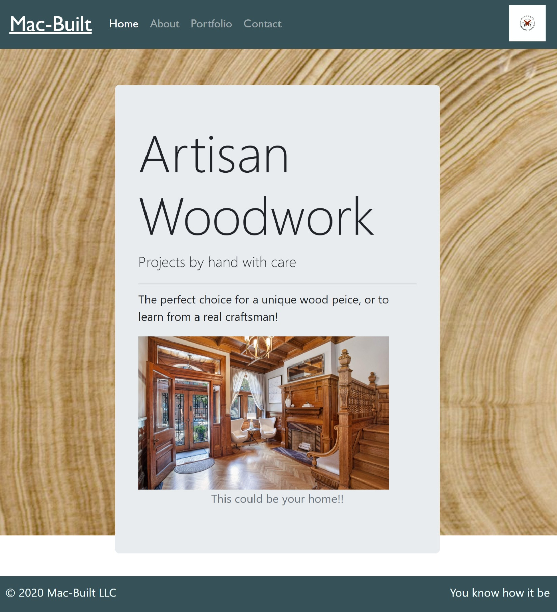

>## Artisan Portfolio Website
---
This is a project for a very good friend of mine who is considering turning his woodworking passion into a business! The website features a custom responsive layout, with multiple pages including.
- A picture showcase for blueprints and finished projects.
- An about the craftsman page to add a relatable element and allow users to get acquainted with the artist.
- a conact form for users to send a comment or request.
- planned espansion for a possible online storefront.
---
please find a screen shot below

